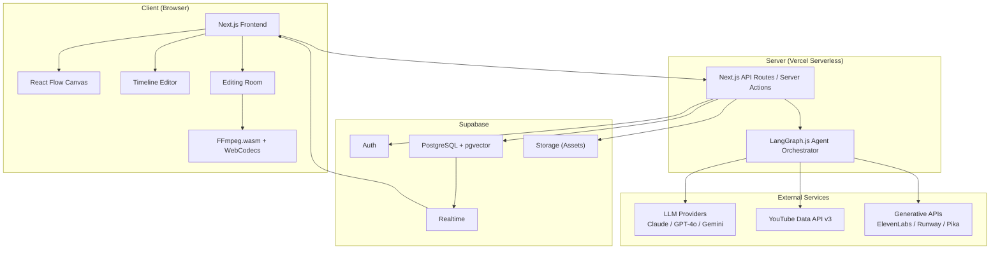
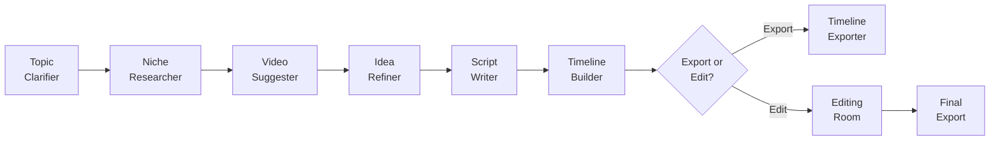
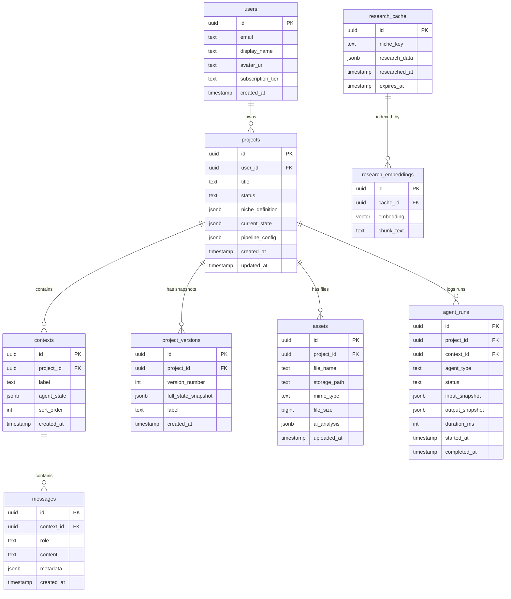

# Creator Tool — Comprehensive Development Plan

> **"AI that amplifies your creativity, not replaces it."**

**Last updated:** April 2026
**Status:** Pre-development planning

---

## Table of Contents

1. [Vision and Ethos](#1-vision-and-ethos)
2. [Feature Inventory](#2-feature-inventory)
3. [Architecture](#3-architecture)
4. [Agent Pipeline](#4-agent-pipeline)
5. [UI/UX Specification](#5-uiux-specification)
6. [Data Model](#6-data-model)
7. [Phased Roadmap](#7-phased-roadmap)
8. [Monetization Strategy](#8-monetization-strategy)
9. [Risks and Open Questions](#9-risks-and-open-questions)

---

## 1. Vision and Ethos

### Product Vision

A web application that guides video creators — primarily aspiring and growing YouTubers — through
the entire pre-production pipeline (research, niche analysis, idea refinement, scripting, timeline
construction) and optionally into assisted post-production (in-app video editing), with AI acting
exclusively as a coach, researcher, and structural advisor.

The product sits at the intersection of:

- **ChatGPT-style conversational AI** (guided Q&A with the creator)
- **Node-based workflow tools** (n8n, Figma-style infinite canvas for visualizing the creative pipeline)
- **Video editing assistants** (timeline building, format suggestions, export)

### Core Ethos — "Helper-First, Never Creator-First"

The current web ecosystem suffers from an influx of low-quality, fully AI-generated content — often
labeled "AI slop." A significant and growing portion of internet users actively reject content
that feels machine-produced, which damages the credibility of creators who rely on those tools.

This product takes the opposite stance:

- **AI never replaces the creative process.** It accelerates the parts that surround it: market
  research, competitor analysis, storytelling structure, pacing theory, trend identification.
- **The user owns every decision.** Every agent suggestion is a draft the user approves, modifies,
  or discards. Nothing is final until the creator says it is.
- **No forced acceptance.** At no point is the user locked into an AI-generated output. Every node
  in the pipeline is revisitable, tweakable, and re-runnable.
- **Transparency over magic.** The system explains *why* it suggests something (backed by niche
  data, retention patterns, storytelling principles) rather than just outputting a result.

This philosophy must guide every feature decision going forward: if a proposed feature replaces a
creative decision rather than informing it, it violates the ethos and should be redesigned or dropped.

### Market Positioning

- **Not** a "make videos for you" tool (Pictory, InVideo, Synthesia territory).
- **Not** a pure video editor (Premiere, DaVinci, CapCut territory).
- **Is** the intelligent pre-production and assisted-production layer that sits *between* the
  creator's idea and the final edit — whether that edit happens internally or in an external tool.
- Closest analogies: NotebookLM (deep research) + n8n (visual workflow) + Descript (assisted editing)
  — but purpose-built for the video creator pipeline.

---

## 2. Feature Inventory

Every feature is tagged with its target phase: **MVP**, **v1**, **v2**, or **v3+**.

### 2.1 Core Pipeline (Agent Workflow)

| Feature | Phase | Description |
|---|---|---|
| Topic Clarification Agent | MVP | Interactive Q&A that drills a vague idea ("sports videos") into a specific niche ("NBA game breakdowns with betting angles") |
| Internal Research Base (RAG) | MVP | Vector-indexed cache of previous deep research; avoids redundant analysis for recurring niches |
| Video Suggestions Engine | MVP | Surface recent trends, popular videos, and competitor content relevant to the refined niche via YouTube Data API |
| Idea Refinement Phase | MVP | Prompt the user for a specific video topic; show existing content in that space; help the user find a unique angle |
| Script Agent | MVP | Generate a structured script draft with sections, storytelling hooks, suggested tone, pacing, and format notes |
| Timeline Builder | MVP | Visual, draggable timeline with sections, durations, B-roll placeholders, and real-time impact feedback |
| Impact Feedback Engine | MVP | Sidebar insights on how timeline/script changes affect retention, storytelling coherence, and engagement (niche-aware) |
| Timeline Export | MVP | Export to JSON, FCPXML (Premiere/Final Cut), and EDL (DaVinci) formats |
| Assisted Editing Room | v1 | In-app interface where the user views the constructed timeline with its gaps and suggested content, then decides how to fill each gap: with their own uploaded media (proprietary video/audio) or with AI-generated content from integrated partners (ElevenLabs, etc.). Not a full NLE — no complex effects or transitions. |
| Context-Aware Project Agent | v1 | Always-on agent that monitors the full project state and continuously updates context/config as the user makes changes |

### 2.2 User Interface

| Feature | Phase | Description |
|---|---|---|
| Three-Panel Layout | MVP | Left (project/context list), Center (node canvas), Right (context-sensitive config/preview) |
| Infinite Node Canvas | MVP | React Flow-based canvas showing the agent pipeline as interactive, connected nodes |
| Node State Visualization | MVP | Nodes show waiting/running/complete/error states; dependency edges between nodes |
| Right Panel (Event-Driven) | MVP | Dynamically renders config, previews, or chat based on which node/element is selected |
| Canvas-to-Timeline View Switch | MVP | Toggle between the pipeline canvas and the dedicated timeline editor |
| Editing Room Interface | v1 | Timeline gap-filling UI: view the timeline with gaps highlighted, fill with uploaded media or AI-generated content from integrations. Media bin + AI sidebar. No effects panel. |
| Project Templates Gallery | v1 | Pre-built pipeline flows for popular niches (e.g., "Music Video Essay", "Sports Highlights Breakdown") |
| Mobile-Responsive Canvas | v2 | Read-only review mode optimized for phone/tablet |
| Mobile Companion App | v3+ | Native or PWA companion for reviewing projects on the go |

### 2.3 Data and Intelligence

| Feature | Phase | Description |
|---|---|---|
| YouTube Data API Integration | MVP | Official API for search, channel stats, video metadata, trending content — no scraping |
| pgvector RAG Cache | MVP | Embeddings of past niche analyses, trend snapshots, and channel profiles for instant recall |
| Version History | v1 | Lightweight JSON snapshots of full project state; undo/branch/restore |
| Retention Simulator | v1 | Estimated watch-time curve overlay on the timeline based on section pacing and historical niche data |
| Advanced RAG + Community Knowledge | v2 | Shared, opt-in knowledge base enriched by anonymized aggregate research across users |

### 2.4 Integrations and Export

| Feature | Phase | Description |
|---|---|---|
| FFmpeg.wasm Client-Side Export | MVP | Browser-based MP4 encoding; zero server cost; user files stay on device |
| FCPXML / EDL / JSON Export | MVP | First-class timeline export for Premiere, DaVinci, Final Cut, CapCut |
| Early Asset Upload | v1 | Upload sample footage/clips for multi-modal AI style analysis |
| Generative Tool Integrations | v2 | One-click prompts to ElevenLabs (voice-over), Runway/Pika (B-roll generation), stock libraries |
| YouTube/TikTok Upload Automation | v2 | Direct publish with AI-generated title, description, tags, and SEO suggestions |
| Cloud Video Rendering | v2 | Optional server-side rendering (Mux/Shotstack) for heavy projects in the paid tier |
| Extended Editor Export | v3+ | CapCut project files, DaVinci Resolve plugins, additional NLE formats |

### 2.5 Platform and Business

| Feature | Phase | Description |
|---|---|---|
| Supabase Auth (Email + OAuth) | MVP | User registration and login |
| Stripe Billing Integration | v1 | Free and Pro tier management |
| Analytics Dashboard | v1 | Project history, usage stats, AI call tracking |
| Real-Time Collaboration | v2 | Share a project with an editor/co-creator; live cursors and edits via Supabase Realtime |
| Team Workspaces | v3+ | Multi-seat accounts with role-based access |

---

## 3. Architecture

### 3.1 Tech Stack

| Layer | Technology | Rationale |
|---|---|---|
| **Framework** | Next.js 15+ (App Router, Server Components) | SSR/SSG flexibility, API routes, server actions, Vercel-native deployment |
| **Language** | TypeScript (strict) | Type safety across the full stack; better DX for complex state |
| **UI** | React 19 + Tailwind CSS + shadcn/ui + Framer Motion | Modern component library, utility-first styling, smooth animations |
| **Node Canvas** | xyflow (React Flow) | Most mature infinite-canvas library; custom nodes, edges, real-time updates, drag-and-drop |
| **Agent Orchestration** | LangGraph.js | Stateful directed graphs with checkpointing; perfect for sequential-but-revisitable, human-in-the-loop agent pipelines |
| **AI Models** | Vercel AI SDK + Claude / GPT-4o / Gemini | Multi-provider flexibility; streaming responses; multi-modal support for image/video analysis. **Confirmed as the provider abstraction layer.** See note in section 4.3 on how it interfaces with LangGraph.js. |
| **Database** | Supabase (PostgreSQL + pgvector) | Auth, relational data, vector search for RAG, Realtime subscriptions, Storage — single managed service. **Instance created and connected via MCP** (empty, tables to be created in Phase 0). |
| **State Management** | Zustand | Lightweight, performant client state; integrates cleanly with React Flow's internal store |
| **Video Processing** | FFmpeg.wasm + WebCodecs API | Browser-first video encoding; zero server cost; privacy-preserving (files stay on device) |
| **Hosting** | Vercel (frontend + serverless) + Supabase (backend) | Zero-ops deployment; automatic scaling; edge functions. **Vercel project already linked** — CI/CD setup pending. Custom domain to be configured post-MVP. |
| **Payments** | Stripe | Industry standard; Supabase has first-class Stripe webhook integration patterns |
| **Observability** | LangSmith (agent tracing) + Vercel Analytics | Debug agent behavior; monitor performance and usage |

### 3.2 System Architecture Diagram



### 3.3 Component Breakdown

```
src/
  app/                          # Next.js App Router
    (auth)/                     # Login, signup, password reset
    (dashboard)/                # Authenticated app shell
      projects/                 # Project list (left panel data source)
      editor/[projectId]/       # Main three-panel workspace
        page.tsx                # Layout: left panel + canvas/timeline + right panel
    api/                        # API routes
      agents/                   # LangGraph agent endpoints
      export/                   # Timeline export (FCPXML, EDL, JSON)
      youtube/                  # YouTube Data API proxy
  components/
    canvas/                     # React Flow canvas, custom node types
      nodes/                    # TopicClarificationNode, ScriptNode, TimelineNode, etc.
      edges/                    # Custom dependency edges
    timeline/                   # Timeline editor components
    editing-room/               # In-app video editing components (v1)
    panels/                     # Left panel, right panel (context-sensitive)
    chat/                       # Conversational AI interface (right panel mode)
    ui/                         # shadcn/ui primitives
  lib/
    agents/                     # LangGraph agent definitions
      topic-clarifier.ts
      niche-researcher.ts
      video-suggester.ts
      idea-refiner.ts
      script-writer.ts
      timeline-builder.ts
      impact-analyzer.ts
      project-monitor.ts        # Always-on context agent (v1)
    rag/                        # RAG utilities (embed, query, cache)
    export/                     # FCPXML, EDL, JSON generators
    youtube/                    # YouTube Data API client
    supabase/                   # Supabase client, helpers, types
    store/                      # Zustand stores
  types/                        # Shared TypeScript types
```

---

## 4. Agent Pipeline

The core product is a sequence of AI agents, each represented as a node on the canvas. Agents
depend on the output of previous agents but can always be revisited and re-run, which propagates
changes downstream.

### 4.1 Pipeline Overview



### 4.2 Agent Specifications

#### Agent 1: Topic Clarifier

- **Purpose:** Transform a vague, high-level user idea into a precisely defined content niche.
- **Trigger:** User types an initial idea (e.g., "sports videos").
- **Behavior:** Interactive, multi-turn conversation. Asks targeted follow-up questions to narrow
  the scope ("Which sport?", "Which league?", "Video essays or live updates?", "Betting angle?").
  Checks the RAG cache for existing research on similar niches to accelerate the process.
- **Input:** Raw user text.
- **Output:** `NicheDefinition` object — category, sub-category, audience profile, content tone,
  competitive landscape summary.
- **Node type:** `TopicClarificationNode` (chat-enabled, shows Q&A history).

#### Agent 2: Niche Researcher

- **Purpose:** Deep-dive into the defined niche using internal RAG and external data.
- **Trigger:** Topic Clarifier completes and produces a `NicheDefinition`.
- **Behavior:** Queries pgvector for existing research on the niche. If cache hit, surfaces stored
  insights immediately. If miss, triggers fresh research via YouTube Data API (top channels, most
  viewed videos, growth trends) and web research. Stores new embeddings for future reuse.
- **Input:** `NicheDefinition`.
- **Output:** `NicheResearchReport` — top channels, video performance benchmarks, audience
  demographics, content gaps, trending sub-topics.
- **Node type:** `ResearchNode` (displays report with expandable sections).

#### Agent 3: Video Suggester

- **Purpose:** Curate a set of reference videos the user can watch to calibrate their vision.
- **Trigger:** Niche Researcher completes.
- **Behavior:** Uses the research report + YouTube Data API to surface recent trending videos,
  all-time top performers, and "hidden gem" videos in the niche. Presents them with thumbnails,
  view counts, and brief AI-generated analysis of why each is relevant. Listens for user
  reactions and updates context accordingly.
- **Input:** `NicheResearchReport`.
- **Output:** `VideoReferenceSet` — list of reference videos with metadata and relevance tags;
  updated user preference signals.
- **Node type:** `VideoSuggestionNode` (card grid with embedded YouTube previews).

#### Agent 4: Idea Refiner

- **Purpose:** Help the user commit to a specific video topic and unique angle.
- **Trigger:** User has reviewed video suggestions (or skipped them).
- **Behavior:** Prompts "What's your next video about?" Accepts free-form input or picks from
  AI-suggested topics (based on trends, gaps, popular formats). For whatever the user inputs,
  shows existing content on that exact topic so the user understands the competitive landscape
  before committing. Helps refine the unique angle.
- **Input:** `VideoReferenceSet` + user free-form input.
- **Output:** `VideoIdea` — title working draft, unique angle, target audience, differentiation
  from existing content, estimated appeal.
- **Node type:** `IdeaRefinerNode` (split view: user input + competitor cards).

#### Agent 5: Script Writer

- **Purpose:** Produce a structured script draft with storytelling guidance.
- **Trigger:** Idea Refiner produces a confirmed `VideoIdea`.
- **Behavior:** Generates a multi-section script outline based on storytelling theory best practices
  for the specific niche. Includes: hook, intro, body sections with key points, climax/payoff,
  CTA/outro. Also suggests the video format: camera takes (if applicable), voice-over tone,
  storytelling style (narrative, analytical, comedic, etc.), pacing notes.
- **Input:** `VideoIdea` + `NicheResearchReport` (for niche-appropriate conventions).
- **Output:** `ScriptDraft` — ordered sections with content, timing estimates, format notes,
  storytelling annotations.
- **Node type:** `ScriptNode` (rich text editor with section markers and format sidebar).

#### Agent 6: Timeline Builder

- **Purpose:** Translate the script into a visual, malleable video timeline.
- **Trigger:** Script Writer produces a confirmed `ScriptDraft`.
- **Behavior:** Generates a timeline with sections mapped to durations, B-roll placeholder slots,
  transition points, and audio cue markers. Every element is draggable and resizable. On any user
  modification, the Impact Feedback Engine re-evaluates and surfaces real-time insights.
- **Input:** `ScriptDraft`.
- **Output:** `TimelineDefinition` — ordered timeline segments with durations, media placeholders,
  transition markers, and section metadata.
- **Node type:** `TimelineNode` (opens the dedicated timeline view).

#### Supporting Agent: Impact Feedback Engine

- **Purpose:** Provide continuous, context-aware feedback on how changes affect the video's
  projected performance.
- **Runs:** Passively alongside Timeline Builder and Editing Room.
- **Behavior:** Monitors the current project state. On any change (section reorder, duration
  adjustment, script edit), re-computes estimated retention curve, storytelling coherence score,
  pacing analysis, and engagement projections — all calibrated to the specific niche.
- **Output:** Real-time sidebar with metrics, warnings, and suggestions.

### 4.3 Agent Orchestration (LangGraph.js)

Each agent is a node in a LangGraph directed graph with:

- **State schema:** Typed project state that flows between agents.
- **Checkpoints:** After each agent completes, the full state is checkpointed. This enables:
  - Re-running any agent with modified inputs without losing downstream work.
  - Branching (v1): run an alternative and compare.
  - Undo: restore any previous checkpoint.
- **Human-in-the-loop interrupts:** Every agent pauses for user review before marking its output
  as confirmed and triggering the next agent.
- **Tool calling:** Agents have access to tools (YouTube API, RAG query, web search) via LangGraph's
  tool-calling mechanism.

#### How Vercel AI SDK and LangGraph.js work together

> **Note:** This section exists because the relationship between these two libraries needs to be
> well-understood before implementation begins. A dedicated spike/prototype is recommended early
> in Sprint 1 to validate the integration.

- **Vercel AI SDK** handles the LLM communication layer: sending prompts, streaming responses,
  managing provider-specific API differences (Claude, GPT-4o, Gemini), and exposing a unified
  interface for tool calling. It abstracts away the transport so switching providers is a config
  change, not a code rewrite.
- **LangGraph.js** handles the orchestration layer: defining the directed graph of agents, managing
  state that flows between them, checkpointing after each step, and implementing human-in-the-loop
  pauses. It does *not* call LLMs directly — it delegates that to the model layer.
- **Integration pattern:** Each LangGraph node (agent) uses the Vercel AI SDK's `generateText` or
  `streamText` functions internally to communicate with the LLM. LangGraph manages *when* and *in
  what order* agents run, what state they receive, and what state they produce. The Vercel AI SDK
  manages *how* each individual LLM call is made.
- In short: LangGraph.js is the workflow engine; Vercel AI SDK is the LLM driver. They are
  complementary, not competing.

---

## 5. UI/UX Specification

### 5.1 Layout Overview

```
+------------------+------------------------------+-------------------+
|                  |                              |                   |
|   LEFT PANEL     |       CENTER PANEL           |   RIGHT PANEL     |
|   (240px fixed)  |       (flex, fills space)    |   (320px, toggle) |
|                  |                              |                   |
|  - Project list  |   Mode A: Node Canvas        |  - Context config |
|  - Context       |     (React Flow infinite     |  - Agent chat     |
|    switcher      |      canvas with pipeline    |  - Preview pane   |
|  - New project   |      nodes)                  |  - Impact metrics |
|    button        |                              |  - Export options  |
|  - Search /      |   Mode B: Timeline Editor    |                   |
|    filter        |     (horizontal timeline     |  (content changes  |
|                  |      with draggable          |   based on what    |
|                  |      sections)               |   is selected)     |
|                  |                              |                   |
|                  |   Mode C: Editing Room (v1)  |                   |
|                  |     (video editor with        |                   |
|                  |      media bins, preview,     |                   |
|                  |      assisted timeline)       |                   |
+------------------+------------------------------+-------------------+
```

### 5.2 Left Panel — Project & Context Manager

- Lists all user projects, sorted by recent activity.
- Each project expands to show its contexts (analogous to "chats" in ChatGPT — different
  exploration threads within the same project).
- "New Project" action triggers the Topic Clarifier flow.
- Collapsible on small screens.

### 5.3 Center Panel — Workspace

**Mode A: Node Canvas (default)**

- React Flow infinite canvas.
- Each pipeline agent is a custom node with:
  - Status indicator (waiting / running / complete / error).
  - Summary of its output (collapsible).
  - Click to select (populates right panel).
  - Double-click to re-enter/re-run.
- Edges show data flow / dependencies between agents.
- Nodes that depend on incomplete upstream agents appear dimmed with a "waiting" badge.
- Zoom, pan, minimap for orientation.

**Mode B: Timeline Editor**

- Activates when the Timeline Builder node is entered or the user switches manually.
- Horizontal, zoomable timeline.
- Sections as colored blocks (mapped from script sections).
- Drag to reorder, resize to adjust duration.
- B-roll placeholder slots (dashed outlines).
- Audio track lanes below the video track.
- Playhead for scrubbing.
- Impact feedback sidebar docked to the right.

**Mode C: Editing Room (v1)**

- **Not a full NLE.** The Editing Room's purpose is to let the user see the timeline with its
  gaps and suggested content, then decide how to fill each gap.
- Timeline view with clearly marked gap slots (dashed/highlighted regions where content is needed).
- For each gap, the user can:
  - Upload their own media (proprietary video, audio, images).
  - Request AI-generated content from integrated partners (e.g., ElevenLabs for voice-over,
    Runway/Pika for B-roll) — always optional.
  - Browse and insert from a stock media library.
- Media bin (uploaded assets, AI-generated assets, stock).
- Preview window with basic playback.
- AI assistant sidebar: contextual suggestions for what content would fit each gap, based on the
  script and niche context.
- Simple cuts and arrangement (reorder, trim, split). No complex effects, transitions, or
  CapCut/Premiere-style editing features.

### 5.4 Right Panel — Context-Sensitive Inspector

The right panel renders different content depending on what is selected:

| Selection | Right Panel Content |
|---|---|
| No selection | Project overview, global settings, quick stats |
| Topic Clarifier node | Live chat interface with the clarification agent |
| Research node | Research report viewer with expandable sections |
| Video Suggestion node | Video card browser with YouTube embeds |
| Idea Refiner node | Idea editor, competitor comparison cards |
| Script node | Script section editor, format configuration, storytelling tips |
| Timeline node / segment | Segment properties, duration, B-roll suggestions, impact metrics |
| Editing Room gap / clip | Gap-filling options (upload, AI-generate, stock), clip trim/split controls, AI suggestions for content |

### 5.5 Interaction Principles

- **Progressive disclosure:** Only show complexity when the user asks for it. Default views are
  clean and focused.
- **Animations:** Framer Motion for panel transitions, node state changes, and timeline interactions.
  Smooth but never slow.
- **Keyboard shortcuts:** Common actions (run agent, confirm, undo, switch view) have keyboard
  bindings.
- **Undo everywhere:** Ctrl+Z works across canvas, timeline, and editor — backed by checkpoints.

---

## 6. Data Model

### 6.1 Entity Relationship Diagram



### 6.2 Key Design Decisions

- **`current_state` on projects:** A single JSONB column holds the full pipeline state (all agent
  outputs, timeline definition, user preferences). This is what LangGraph checkpoints serialize to.
  Enables fast reads and atomic updates.
- **`project_versions`:** Immutable snapshots of `current_state` at user-defined or automatic
  save points. Lightweight branching: create a new project row that copies a version snapshot.
- **`research_cache` + `research_embeddings`:** Two-table design separates the raw research data
  from its vector index. The embeddings table uses pgvector's `vector` type for similarity search.
  Cache entries expire to ensure freshness (configurable per niche volatility).
- **`agent_runs`:** Audit log for every agent execution. Useful for debugging, replay, and
  analytics. Stores input/output snapshots so runs are fully reproducible.
- **Storage:** User-uploaded assets live in Supabase Storage with row-level security. The `assets`
  table holds metadata and references the storage path.

---

## 7. Phased Roadmap

### Phase 0: Project Bootstrap (Week 1) — COMPLETE

**Goal:** Repository setup, tooling, and a working skeleton.

> **Status:** All Phase 0 tasks completed. Supabase MCP connected (empty — schema pending).
> GitHub repo linked. Vercel project linked (CI/CD import still pending).

| Task | Status | Details |
|---|---|---|
| Initialize Next.js project | Done | Next.js 16 (App Router), TypeScript strict, Tailwind v4, ESLint |
| Install core dependencies | Done | React Flow, shadcn/ui, Framer Motion, Zustand, Vercel AI SDK, LangGraph.js, Vitest |
| Font & typography | Done | Inter font, 13px base size, compact Figma-like UI system |
| Agent pipeline + tests | Done | All 6 agents + Impact Engine implemented (stubbed), 27 tests passing via Vitest |
| Supabase schema setup | Pending | Tables and RLS policies not yet created |
| CI/CD | Pending | Import existing GitHub repo into Vercel; enable preview deployments on PR |
| Basic layout shell | Done | Three-panel layout (left: projects, center: canvas, right: inspector) |

### Phase 1: MVP (Weeks 2-8)

**Goal:** A functional end-to-end flow from idea input to timeline export. One user can go through
the full pipeline, interact with every agent, build a timeline, and export it.

#### Sprint 1 (Weeks 2-3): Canvas and First Two Agents

- [x] React Flow canvas with custom node components and edge types
- [x] Node state machine (waiting / running / complete / error) with visual indicators
- [x] Left panel: project list (client-side Zustand store), create new project
- [x] Right panel: framework with dynamic content switching based on selected node
- [x] Topic Clarifier agent (LangGraph.js): multi-turn chat, niche drilling
- [x] Right panel chat UI for Topic Clarifier interaction
- [x] Zustand pipeline store connecting UI ↔ agents ↔ canvas state
- [ ] Left panel: persist project list to Supabase (currently client-side only)
- [ ] Basic Supabase schema: `users`, `projects`, `contexts`, `messages`
- [ ] Niche Researcher: wire right panel UI to display research report after clarifier completes

#### Sprint 2 (Weeks 4-5): Research, Suggestions, and Idea Refinement

- [x] Niche Researcher agent: structured report generation (stubbed, needs YouTube API)
- [ ] Niche Researcher: YouTube Data API v3 integration for live data
- [ ] pgvector setup: embedding pipeline, similarity search, cache storage
- [ ] RAG cache: store and retrieve previous niche research
- [x] Video Suggester agent: curate reference videos with metadata and relevance (stubbed)
- [ ] Video card grid in the right panel with YouTube embed previews
- [x] Idea Refiner agent: specific topic selection, competitor awareness, unique angle (stubbed)
- [x] Downstream node triggering: completing one agent enables the next (via Zustand store)

#### Sprint 3 (Weeks 6-7): Script and Timeline

- [x] Script Writer agent: structured script generation with sections, storytelling annotations (stubbed)
- [ ] Script editor in right panel: rich text with section markers, format sidebar
- [x] Timeline Builder agent: convert script to visual timeline definition (stubbed)
- [ ] Timeline editor view: horizontal draggable timeline with sections, placeholders, lanes
- [x] Impact Feedback Engine: retention/pacing/engagement analysis (stubbed)
- [ ] Impact Feedback: wire sidebar UI to display real-time metrics
- [x] View switching between canvas and timeline (tab UI implemented)

#### Sprint 4 (Week 8): Export and Polish

- [ ] Timeline export: JSON format
- [ ] Timeline export: FCPXML (Premiere / Final Cut)
- [ ] Timeline export: EDL (DaVinci Resolve)
- [ ] FFmpeg.wasm integration: basic MP4 export from timeline (placeholder media)
- [ ] End-to-end testing of the full pipeline flow
- [ ] Error handling, loading states, empty states
- [ ] Basic responsive behavior (warn on mobile, functional on tablet+)

#### MVP Acceptance Criteria

- A user can create a project, go through all six pipeline agents sequentially, and export a
  timeline in at least two formats.
- Every agent pauses for user review; no output is applied without confirmation.
- Revisiting a completed node and changing its output correctly invalidates/re-triggers downstream nodes.
- The RAG cache stores and retrieves at least niche research data.
- The timeline is visually draggable and shows impact feedback on changes.

---

### Phase 2: v1 — Production-Ready (Months 3-5 post-MVP)

**Goal:** Monetization-ready product with the Editing Room, billing, version history, and polish.

#### Editing Room (Gap-Filling Interface)

- [ ] Timeline view with gap slots clearly highlighted (dashed regions where content is needed)
- [ ] Gap-filling workflow: for each gap, choose upload (own media), AI-generate (partner integration), or stock media
- [ ] Media bin: user uploads, AI-generated assets, stock library browser
- [ ] Preview window with basic playback (WebCodecs)
- [ ] AI assistant sidebar: contextual suggestions for what content fits each gap (script/niche-aware)
- [ ] Simple cuts and arrangement: reorder, trim, split segments
- [ ] FFmpeg.wasm: multi-format export (MP4, WebM) with encoding options
- [ ] Integration points for generative APIs (ElevenLabs voice-over, Runway/Pika B-roll — stubbed interfaces for v1, functional in v2)

#### Monetization

- [ ] Stripe integration: subscription management, webhook handlers
- [ ] Free tier: full research pipeline + timeline export (JSON only), limited AI calls/month
- [ ] Pro tier ($15-29/mo): all export formats, Editing Room, unlimited AI calls, private RAG
- [ ] Usage tracking: AI call counts per user, stored in Supabase
- [ ] Rate limiting middleware on AI endpoints

#### Version History and Branching

- [ ] Automatic snapshots on agent completion and user-triggered saves
- [ ] Version list in project settings (right panel)
- [ ] Restore any previous version
- [ ] Branch: duplicate a version into a new context for experimentation

#### Templates

- [ ] 5-10 pre-built pipeline templates for popular niches
- [ ] Template gallery accessible from "New Project"

#### Analytics Dashboard

- [ ] Project history: list of all projects with status and last activity
- [ ] Usage stats: AI calls used, exports, editing time
- [ ] Basic niche insights: aggregate trends from the user's research history

#### v1 Acceptance Criteria

- A paying user can view the timeline with gaps, fill them with uploaded media or AI-generated
  content (stubbed integrations), perform simple cuts/arrangement, and export a finished MP4.
- Free users can go through the full research pipeline and export a JSON timeline.
- Version history allows restoring any previous project state.
- Stripe billing works end-to-end (subscribe, upgrade, cancel, webhook-driven tier updates).

---

### Phase 3: v2 — Scale and Polish (Months 6-9)

**Goal:** Collaboration, mobile support, advanced intelligence, and third-party integrations.

| Feature | Details |
|---|---|
| Real-time collaboration | Supabase Realtime: live cursors, concurrent editing, presence indicators. Share a project via invite link with role (editor, viewer). |
| Mobile-optimized canvas | Responsive React Flow canvas in read-only review mode. Touch-friendly node inspection. |
| Advanced RAG | Cross-user anonymized knowledge base (opt-in). Richer embeddings: video transcript analysis, thumbnail style vectors. |
| Generative integrations | ElevenLabs voice-over generation, Runway/Pika B-roll generation, stock media library search. All optional — user can always upload their own. |
| YouTube/TikTok upload | Direct publish from the app. AI-generated title, description, tags, and thumbnail suggestions based on full project context. |
| Cloud rendering | Server-side rendering via Mux or Shotstack for projects that exceed browser capabilities. Pro-tier feature. |
| Retention simulator | Visual watch-time curve overlay on the timeline. Updates in real-time as the user adjusts pacing, sections, hooks. |
| Guided onboarding tour | Interactive first-time user walkthrough: tooltips on each UI region, sample pipeline run, template suggestion. |

#### v2 Acceptance Criteria

- Two users can simultaneously edit the same project with live updates.
- A user can generate a voice-over via ElevenLabs and insert it into the timeline without leaving the app.
- A user can publish directly to YouTube with AI-suggested metadata.
- The retention simulator displays a plausible curve that updates on timeline changes.

---

### Phase 4: v3+ — Platform Expansion

| Feature | Details |
|---|---|
| Team workspaces | Multi-seat accounts, role-based access (admin, editor, viewer), shared template libraries. |
| Extended NLE export | CapCut project files, DaVinci Resolve plugin for direct import, Adobe Premiere plugin. |
| Mobile companion app | PWA or React Native app for project review, notifications, quick approvals on the go. |
| API / SDK | Public API for third-party integrations; let creators build custom pipeline agents. |
| Localization | Multi-language UI and agent prompts for non-English markets. |

---

## 8. Monetization Strategy

### Tier Structure

| | Free | Pro | Team (v3+) |
|---|---|---|---|
| **Price** | $0 | $15-29/mo | Custom |
| Research pipeline | Full | Full | Full |
| AI calls / month | Limited (e.g., 50) | Unlimited | Unlimited |
| Timeline export | JSON only | JSON + FCPXML + EDL | All formats |
| Editing Room | Not available | Full access | Full access |
| Video export | Not available | MP4 + WebM (browser) | + Cloud rendering |
| RAG | Shared cache | + Private research cache | + Team knowledge base |
| Version history | Last 3 versions | Unlimited | Unlimited |
| Collaboration | Not available | Not available | Real-time multi-user |
| Upload automation | Not available | YouTube + TikTok | + Custom platforms |
| Generative integrations | Not available | Pay-per-use | Included quota |

### Revenue Levers

1. **Subscription (primary):** Pro tier recurring revenue.
2. **Usage-based (secondary):** Generative API calls (voice-over, B-roll) charged at cost + margin,
   even for Pro users beyond a fair-use threshold.
3. **Team seats (v3+):** Per-seat pricing for collaborative workspaces.

### Conversion Funnel

```
Free signup → Research pipeline (value demonstrated) → Timeline export (hooked)
  → "Edit in-app" CTA (conversion point) → Pro subscription → Generative upsells
```

The critical insight: the free tier delivers genuine value (research + basic export) so the user
is already invested in the project before hitting the paywall. The Editing Room is the natural
upgrade moment — the user has a complete timeline and wants to bring it to life.

---

## 9. Risks and Open Questions

### Technical Risks

| Risk | Severity | Mitigation |
|---|---|---|
| FFmpeg.wasm performance on large projects | High | Start with short-form content (<15min). Add cloud rendering escape hatch in v2. Profile early and set browser memory limits. |
| LangGraph.js maturity / breaking changes | Medium | Pin versions aggressively. Abstract agent definitions behind an internal interface so the orchestrator is swappable. |
| React Flow performance with many nodes | Low | The pipeline has 6-10 nodes max. Not a concern unless we add sub-flows. Monitor if templates grow complex. |
| YouTube Data API quotas | Medium | Cache aggressively in RAG. Implement per-user quota awareness. Apply for higher quota if needed. |
| Multi-modal AI costs (video/image analysis) | Medium | Use multi-modal only for asset analysis (opt-in). Text-based agents use cheaper models where possible. |

### Product Risks

| Risk | Severity | Mitigation |
|---|---|---|
| Scope creep before MVP | High | The phased roadmap is the mitigation. Ruthlessly cut anything not in the MVP feature list. Ship and iterate. |
| Editing Room complexity rivaling real NLEs | High | **Resolved (scope locked).** The Editing Room is a gap-filling interface, not an editor. Users view the timeline with gaps, fill them with uploaded or AI-generated content, and do simple cuts/arrangement. No effects, transitions, or NLE-like features. Complex editing belongs in the export-to-NLE flow. |
| User confusion with hybrid UI paradigm | Medium | Templates that pre-populate the canvas (v1). Guided onboarding tour planned for v2. Tooltips on first interaction with each element. |
| "Helper-first" ethos perceived as limited | Low | Marketing must clearly articulate the value: "you make the creative decisions; we give you the research, structure, and tools to execute faster." Feature parity on the research side must be genuinely excellent. |

### Open Questions

1. **Naming:** "Creator Tool" is a working title. Final product name TBD (the prior conversation
   used "VidForge" as a placeholder).
2. ~~**LLM provider strategy:**~~ **Resolved.** Vercel AI SDK is confirmed as the provider
   abstraction layer. Start with a single provider for MVP, switch or add providers trivially
   via the SDK. See section 4.3 for how it interfaces with LangGraph.js.
3. **Timeline export fidelity:** How much metadata can we realistically encode in FCPXML/EDL
   (section labels, B-roll markers, audio cues)? Needs a spike/prototype in Sprint 4.
4. ~~**Editing Room scope:**~~ **Resolved.** The Editing Room is a gap-filling interface: the user
   views the timeline with gaps, fills them with uploaded media or AI-generated content from
   partner integrations, and performs simple cuts + arrangement. No complex effects, transitions,
   or NLE-like features. See updated spec in sections 2.1, 5.3, and 7 (v1 roadmap).
5. ~~**Self-hosted vs. SaaS:**~~ **Resolved.** SaaS only. Hosted on Vercel (already linked) with
   Vercel's provided URL; custom domain to be configured later. No self-hosting planned.
6. **Content moderation:** Deferred. Not a concern for MVP or v1 (private tool). Will be revisited
   when shared/community RAG is introduced in v2.

---

## Appendix: Key Library References

| Library | Purpose | Docs |
|---|---|---|
| Next.js 15 | Framework | https://nextjs.org/docs |
| React Flow (xyflow) | Node canvas | https://reactflow.dev |
| LangGraph.js | Agent orchestration | https://langchain-ai.github.io/langgraphjs/ |
| Vercel AI SDK | LLM integration | https://sdk.vercel.ai/docs |
| shadcn/ui | UI components | https://ui.shadcn.com |
| Framer Motion | Animations | https://www.framer.com/motion/ |
| Zustand | State management | https://zustand-demo.pmnd.rs |
| FFmpeg.wasm | Browser video processing | https://ffmpegwasm.netlify.app |
| Supabase | Backend-as-a-service | https://supabase.com/docs |
| Stripe | Payments | https://stripe.com/docs |
| YouTube Data API v3 | Video/channel data | https://developers.google.com/youtube/v3 |
